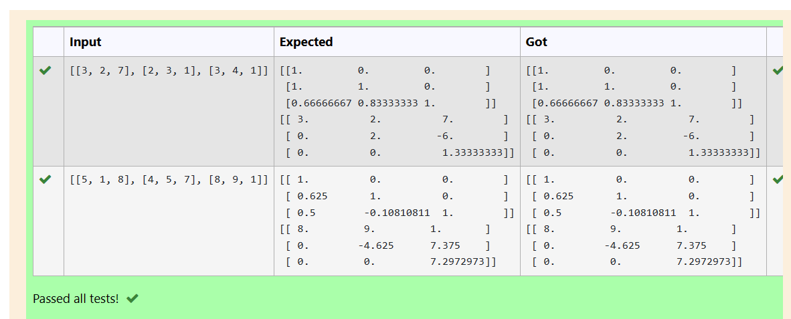

# LU Decomposition without zero on the diagonal

## AIM:
To write a program to find the LU Decomposition of a matrix.

## Equipments Required:
1. Hardware – PCs
2. Anaconda – Python 3.7 Installation / Moodle-Code Runner
## Algorithm
1. import numpy library using import statement. 
2. From scipy package import lu().
3. Get input from user and pass it as an array.
4. Get P, L U martix using lu().
5. print L and U matrix.

## Program:
~~~
import numpy as np
from scipy.linalg import lu
A=np.array(eval(input()))
P,L,U=lu(A)
print(L)
print(U)
/*
Program to find the LU Decomposition of a matrix.
Developed by: Ragul A C
RegisterNumber: 21500141
*/
~~~

## Output:

## Result:
Thus the program to find the LU Decomposition of a matrix is written and verified using python programming.

# LU Decomposition without zero on the diagonal

## AIM:
To write a program to find the LU Decomposition of a matrix.

## Equipments Required:
1. Hardware – PCs
2. Anaconda – Python 3.7 Installation / Moodle-Code Runner
## Algorithm
1. import numpy library using import statement. 
2. From scipy package import lu().
3. Get input from user and pass it as an array.
4. Get P, L U martix using lu().
5. print L and U matrix.

## Program:
~~~
import numpy as np
from scipy.linalg import lu_factor,lu_solve
A=np.array(eval(input()))
B=np.array(eval(input()))
lu,pivot=lu_factor(A)
x=lu_solve((lu,pivot),B)
print(x)
/*
Program to find the LU Decomposition of a matrix.
Developed by: Ragul A C
RegisterNumber: 21500141
*/
~~~

## Output:
.png)

## Result:
Thus the program to find the LU Decomposition of a matrix is written and verified using python programming.

